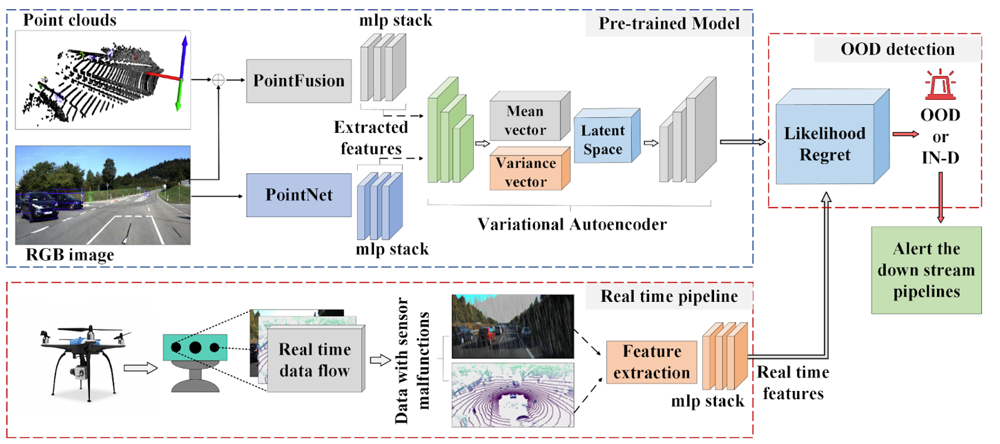

  
  <h3 align="center"><strong>STARNet: Sensor Trustworthiness and Anomaly Recognition via Approximated Likelihood Regret for Robust Edge Autonomy</strong></h3>

  

    <a href="https://scholar.google.com/citations?user=ZKdsKvQAAAAJ&hl=en&oi=ao">Nastaran Darabi</a>1*&nbsp;&nbsp;
    <a href="https://scholar.google.com/citations?user=GjfKPkUAAAAJ&hl=en&oi=ao">Sina Tayebati</a>1*&nbsp;&nbsp;
    <a href="#">Sureshkumar S.</a>1&nbsp;&nbsp;
    <a href="https://scholar.google.com/citations?user=FW-0thoAAAAJ&hl=en">Sathya Ravi</a>1&nbsp;&nbsp;
    <a href="https://scholar.google.com/citations?user=K6FIDzYAAAAJ&hl=en">Theja Tulabandhula</a>1&nbsp;&nbsp;
    <a href="https://scholar.google.com/citations?user=Thpd0HkAAAAJ&hl=en">Amit R. Trivedi</a>1
     
    1University of Illinois Chicago&nbsp;&nbsp;&nbsp;
    *Both authors contributed equally to this work&nbsp;&nbsp;&nbsp;
  

  
  
  
  
  

## About
**STARNet** introduces a deep network designed for anomaly/corruption detection in LiDAR-Camera data pipelines, with focus on implementation on edge AI devices such as micro drones. STARNet employs a gradient-free likelihood regret concept integrated with a variational autoencoder, making implementation on low-complexity edge hardware possible.

  

## Demo: STARNet in action
Bellow we demonstrate a demo of STARNet integrated with <a href="https://airsim-fork.readthedocs.io/en/docs/#">AIRSim</a>, detecting OOD and IN-D data in online streaming.

    

